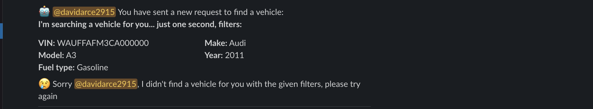
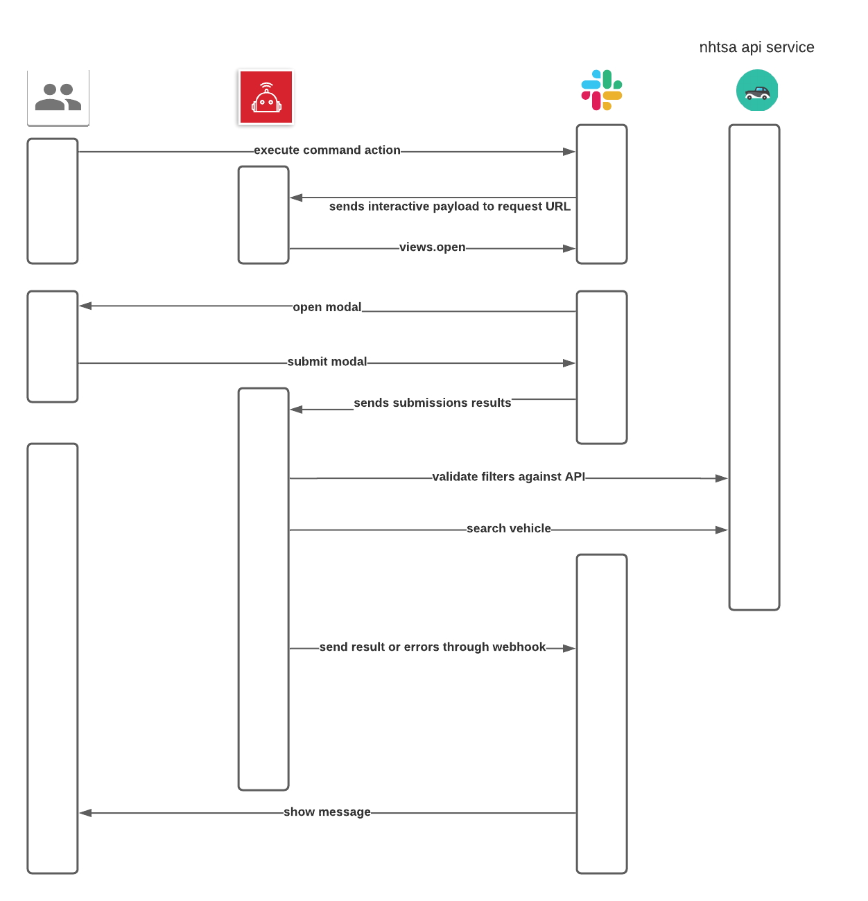

# Getting Started ⚡️ Booster Slack bot
> Slack bot that validates and returns a vehicle for given parameters.

## Overview

This is a [Slack app][2] built with nodeJs as a backend service that showcases
responding to events and interactive buttons.

## How to use it

- User enters Slack Slash command `/findvehicle`
- Then it displays a welcome message and show a modal to enter filters to find a vehicle.
- Finally it returns a vehicle for given filters.


### Filters validation

The Booster slack bot validates the information against [NHTSA’s data][1] 


When the bot does not find a vehicle for given filters it returns a message with the error.



### Results, Errors and rest of the messages are published in a channel named `#booster-bot-testing`

## Running NodeJs Backend service locally

### 1. Setup your local project

```zsh
# Clone this project onto your machine
git clone git@github.com:davidarce/booster-slack-bot.git

# Change into the project
cd booster-slack-bot/

# Install the dependencies
npm install
```

### 2. Create a .env file with environment variables

```zsh
# Replace with your bot and app token
SLACK_SIGNING_SECRET=<your-signing-secret-token>
SLACK_BOT_TOKEN=<your-slack-bot-token>
SLACK_PUBLISH_RESULT_WEBHOOK_URL=<your-slack-webhook-url>
```

### 3. Start servers
```zsh
# run app in production mode
npm run start:prod

# run app in development mode
npm run start:watch
```

## Web Architecture



See you there and thanks!

[1]: https://vpic.nhtsa.dot.gov/api/
[2]: https://api.slack.com/bot-users